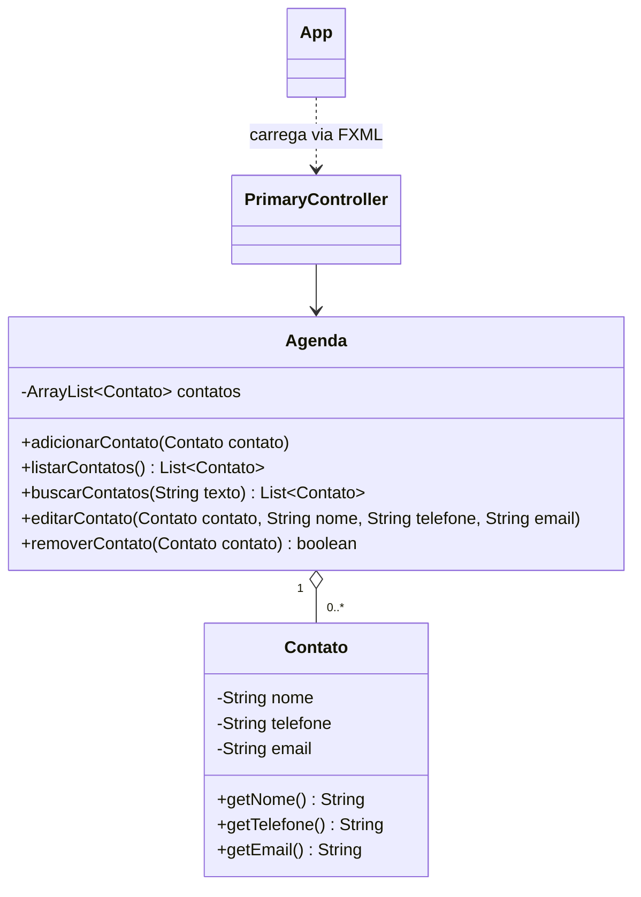

# Diagrama de classes

```mermaid
classDiagram
    class Contato {
        -String nome
        -String telefone
        -String email
        +getNome() String
        +getTelefone() String
        +getEmail() String
    }
    class Agenda {
        -ArrayList~Contato~ contatos
        +adicionarContato(Contato contato)
        +listarContatos() List~Contato~
        +buscarContatos(String texto) List~Contato~
        +editarContato(Contato contato, String nome, String telefone, String email)
        +removerContato(Contato contato) boolean
    }
    class PrimaryController
    class App
    Agenda "1" o-- "0..*" Contato
    PrimaryController --> Agenda
    App ..> PrimaryController : carrega via FXML
```
